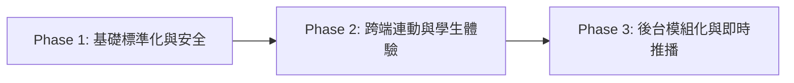

# LINLI 家教學習管理平台 — 全端架構與產品體驗深度優化提案書
> **專案版本**：Next.js 16.1.1 (App Router) + React 19 + Supabase  
> **審查角色**：資深全端架構工程師 & 產品體驗 (UX) 架構師  
> **報告日期**：2026-09-16  
> **文件狀態**：規劃與審查階段（未變動任何專案原始碼）

---

## Executive Summary 執行摘要

本專案是一個以「家教/小型補習班師生協作」為核心的教學管理系統，功能涵蓋**進度日誌、成績追蹤、學費結算、獎勵商城、教學行事曆與段考進度排程**，具備高度實用價值與完整的業務閉環。

然而，透過對全站核心原始碼（包括 [`app/admin/page.tsx`](file:///c:/Users/User/Desktop/grade-website/app/admin/page.tsx)、[`app/page.tsx`](file:///c:/Users/User/Desktop/grade-website/app/page.tsx)、[`components/Dashboard.tsx`](file:///c:/Users/User/Desktop/grade-website/components/Dashboard.tsx) 與 [`lib/supabaseClient.ts`](file:///c:/Users/User/Desktop/grade-website/lib/supabaseClient.ts)）的深層掃描，目前專案存在若干**技術債**與**體驗斷層**：

1. **單一龐大元件 (Monolithic Files)**：老師後台高達 **1,662 行**，學生前台 **714 行**，狀態混雜、邏輯高度耦合，維護性與可擴展性極低。
2. **安全性與資料流混亂**：兩大頁面皆**硬編碼 Supabase URL 與 Anon Key**，繞過共用的 `supabaseClient.ts`；學生密碼明文比對；資料缺乏 TypeScript Interface。
3. **跨端功能不同步**：老師端精心設計的「段考進度規劃 (`course_plans`)」，在學生前台**完全沒有對應的檢視介面**；調課連動時缺少學科過濾，存在意外覆蓋同日其他學科排程的潛在 Bug。
4. **時區判定缺陷 (UTC vs UTC+8)**：多處使用 `new Date().toISOString().slice(0, 10)`，在台灣時間凌晨 00:00~08:00 會產生回溯至「前一日」的嚴重時間差錯誤。
5. **使用者互動體驗落後**：全站仰賴瀏覽器原生的 `alert()` 與 `window.confirm()`，缺乏非阻塞的 Toast 通知、骨架屏 (Skeleton) 與手機端響應式日曆視圖。

本文件針對上述問題提出四大維度的完整診斷與三階段實施藍圖。

---

## 一、 架構與狀態重構（Architecture & State）

### 1.1 單一龐大元件（Monolith）拆解方案
目前所有功能皆以單一檔案堆疊，缺乏職責分離 (Separation of Concerns)：

| 檔案 | 目前行數 | 包含之功能與痛點 | 建議拆分模組 |
| :--- | :--- | :--- | :--- |
| [`app/admin/page.tsx`](file:///c:/Users/User/Desktop/grade-website/app/admin/page.tsx) | **1,662 行** | 包含 9 大 Feature（今日看板、日誌、成績、點數、商品、行事曆、學費、報表、進度規劃）+ 系統設定 + 歷史清單 + 登入 | 拆分子模組至 `components/admin/`：<br>• `TodayDashboard`<br>• `ClassLogManager`<br>• `GradeManager`<br>• `TuitionBilling`<br>• `CalendarManager`<br>• `CoursePlanner`<br>• `RewardShopAdmin`<br>• `StudentSettings` |
| [`app/page.tsx`](file:///c:/Users/User/Desktop/grade-website/app/page.tsx) | **714 行** | 包含學生登入、主題切換、首頁導覽、行事曆、日誌手風琴、成績圖表、學費明細、兌換商店、背包清單 | 拆分子模組至 `components/student/`：<br>• `StudentCalendar`<br>• `StudentClassLogs`<br>• `StudentGradesView`<br>• `StudentTuition`<br>• `StudentRewardAndBag` |
| [`components/Dashboard.tsx`](file:///c:/Users/User/Desktop/grade-website/components/Dashboard.tsx) | **152 行** | 原型初期的孤立元件，完全未被主要流程引用，使用行內樣式且與現代 UI 風格脫節 | 建議**予以廢棄刪除**，或重構為獨立的「家長查詢專區（Parent Portal）」共用元件 |

### 1.2 消除重複狀態與資料流同步問題
- **時薪設定重複**：在 `app/admin/page.tsx` 的「學費結算」頁（第 1430 行）與「設定管理」頁（第 1593 行）存在兩套一模一樣的時薪設定表單與 `localRates` 操作邏輯，導致程式碼冗餘 100+ 行。
- **學生切換狀態脫鉤**：`selectedName`、`plannerStudent` 與行事曆 `evStudent` 各自獨立宣告，切換時常需在 `useEffect` 中手動補丁同步，容易產生 race condition。
- **批次處理效能問題**：在進度規劃儲存時（第 409~424 行 `handleSaveAllPlans`）：
  ```typescript
  // 🔴 目前做法：使用 for 迴圈逐筆發送 HTTP 請求（15堂課 = 15次連線）
  for (const item of plannerRows) {
    await supabase.from("course_plans").upsert(rowPayload);
  }
  ```
  應改為**單次批次 Upsert**：
  ```typescript
  // 🟢 建議做法：一次完成批次寫入
  await supabase.from("course_plans").upsert(batchPayloads);
  ```

### 1.3 Supabase 存取標準化與安全性強化
1. **硬編碼金鑰外洩風險**：
   - [`app/page.tsx`](file:///c:/Users/User/Desktop/grade-website/app/page.tsx#L8-L10) 與 [`app/admin/page.tsx`](file:///c:/Users/User/Desktop/grade-website/app/admin/page.tsx#L8-L10) 皆直接寫死 Supabase Project URL 與 Anon JWT。
   - 應全面收攏至 [`lib/supabaseClient.ts`](file:///c:/Users/User/Desktop/grade-website/lib/supabaseClient.ts)，並透過 `.env.local` 注入。
2. **缺乏 TypeScript Database 型別定義**：
   - 目前全站變數充斥 `any`（如 `grades: any[]`, `studentData: any`, `ev: any`）。
   - 應建立 `types/database.ts`，定義包含 `Student`, `ClassLog`, `Grade`, `PointLog`, `Reward`, `StudentInventory`, `CalendarEvent`, `CoursePlan` 的嚴謹型別。
3. **明文密碼與查詢授權**：
   - 學生登入目前直接在前端執行 `supabase.from("students").select("*").eq("name", ...).eq("password", ...)`，密碼未雜湊且資料表在前端可查詢，存在安全隱患。短中期應至少在前端排除敏感欄位，長遠建議整合 Supabase Auth。

### 1.4 本地時間與時區（UTC vs 本地時區 UTC+8）一致性修正
- **問題癥結**：前端多處混用：
  - `new Date().toISOString().slice(0, 10)`：此為 **UTC 時間**。台灣時區為 UTC+8，每天凌晨 00:00 至 07:59 之間，`toISOString()` 產生的日期會是**前一天**！導致老師在清晨登入登記日誌或排課時，日期預設填錯。
  - `new Date().toLocaleDateString('en-CA')`：此為**本地時間**。
- **解決方案**：
  - 統一建立 `lib/dateUtils.ts`，封裝 `getTodayDateString()`、`formatLocalDate(date)`、`formatTimeRange(start, end)` 等工具函式，確保全站時區運算統一鎖定在 `Asia/Taipei`（UTC+8），杜絕換日幽靈 Bug。

---

## 二、 跨端資料連動檢查（Cross-Portal Consistency）

### 2.1 行事曆停課過濾（`cancelled_dates`）雙端一致性
- **老師後台邏輯**：
  在常態每週排課（`is_recurring: true`）中，老師可針對某特定日期進行「排除此日（單堂停課）」，將該日期寫入 `cancelled_dates: string[]`。
- **學生前台檢視問題**：
  學生端雖然能解析 `cancelled_dates` 並加上刪除線（`text-decoration: line-through`），但依然與正常課堂塞在同一個格子內，且仍會觸發學生以為有課的焦慮。
- **優化方式**：
  - 學生端行事曆的日期格子上方應顯示清楚的徽章（Badge），如 `[停課]` 並降低整體透明度。
  - 在點擊該日彈出詳細視窗時，明確標記：「⚠️ 此堂課老師已設定停課，無需到課」。

### 2.2 調課事件（Reschedule）呈現與資料連動漏洞
在 `app/admin/page.tsx` 的 `handleRescheduleEvent`（第 543~548 行）：
```typescript
// 🔴 潛在嚴重大 Bug：
await supabase.from("course_plans")
  .update({ planned_date: rescheduleDate })
  .eq("student_name", ev.student_name)
  .eq("planned_date", clickedDate); // ❌ 漏掉了 subject 過濾！
```
- **風險**：若該學生在該日期同時有「數學」與「英文」兩門課，老師只調動了英文課，但上述語句會把該學生當天**所有學科的進度表日期**全部搬移到新日期，造成進度表徹底錯亂！
- **修復方式**：必須在比對條件中加上學科比對（根據 `ev.title` 解析或新增 `subject` 關聯欄位）。
- **UX 連動呈現**：
  調課產生的新事件目前標題僅寫「數學 (調課)」，學生看到時不知道這是哪一天挪過來的。應呈現原由提示，例如：「🔄 原 10/12 (四) 調至本日補課」。

### 2.3 預排進度（`course_plans`）學生端唯讀檢視【關鍵缺失補齊】
- **現況缺失**：
  老師後台具有強大的「📅 段考進度規劃」看板，能依據段考日期反推每堂課的規劃進度（如：第 1 堂數列、第 2 堂級數、第 3 堂極限...），但**學生前台目前完全看不到這張表**！
- **產品建議（高價值新增）**：
  1. **學生端首頁 / 學習儀表板新增「🎯 段考進度對照」卡片**：
     - 顯示距離下次段考倒數天數（Countdown）。
     - 顯示「總進度百分比（如：8 / 10 堂，吻合率 90%）」。
     - 提供進度時間軸（Timeline），讓學生與家長一目了然接下來各週預計要教的單元與複習章節。
  2. **學生行事曆彈窗連動**：
     - 當學生在行事曆點選未來某個上課日時，除了顯示「尚未登記上課紀錄」之外，應預先呈現：「🎯 預計進度：1-2 等比數列與級數」。

### 2.4 即時通知連動（Realtime vs Polling）
- 學生在背包點擊「立即使用」商品時，寫入 `student_inventory (status: 'used')`。老師端雖然在「今日看板」有「最新核銷通知」，但必須手動切換頁面或重整才會看到。
- 建議在老師端透過 `supabase.channel('public:student_inventory')` 監聽 `UPDATE` 事件，當學生使用時右上角跳出即時通知紅點或 Toast。

---

## 三、 使用者體驗大幅升級（UX & Interaction）

### 3.1 互動反饋現代化（全面替換原生 Alert / Confirm）
- **痛點**：全站共有超過 25 處使用 `alert("操作成功")`、`window.confirm(...)`。在手機端瀏覽器上，原生對話框會鎖定整個渲染線程，破壞 PWA/App-like 的精緻體驗。
- **改善方案**：
  - 引進非阻塞式通知：操作成功（如儲存日誌、發布日程、核算學費、複製文字）時，右上角滑出輕量 Toast（支援成功綠、警告黃、錯誤紅）。
  - 危險操作確認彈窗（Modal）：刪除學生、停課、扣除點數時，使用客製化的 UI 確認彈窗，並具備按鈕防連點狀態（`disabled={loading}`）。

### 3.2 載入骨架屏（Skeleton）與平滑轉場
- **痛點**：目前切換標籤頁或重新抓取資料時，畫面容易出現白色閃爍或空白區塊，點擊按鈕時只有文字微變，反饋遲鈍。
- **改善方案**：
  - 成績圖表在載入時顯示漸層灰條骨架（Chart Skeleton）。
  - 日誌卡片顯示 3 組波紋骨架（Card Skeleton）。
  - 按鈕加入圓形 Spinner 載入狀態，防止表單重複送出。

### 3.3 教學行政防呆機制（Defensive UX）
1. **成績輸入防呆**：目前分數輸入欄位沒有限制上下限，可輸入負數或超過 100 分。應加上 `min={0} max={100}` 限制與警示。
2. **學費文字複製一鍵化**：複製請款文字後，除了按鈕變「已複製」外，可在手機端提供「以 LINE 分享」或自動開啟通訊軟體的快捷連結。
3. **日誌與作業接續填寫**：老師端已具備「接續上次進度」按鈕，體驗良好；建議擴充至「作業」欄位，可快速帶入「檢討上次作業：[作業內容]」。

### 3.4 手機端（Mobile-First）響應式排版改善
1. **行事曆的「議程清單檢視（Agenda / List View）」**：
   - 目前手機上檢視月曆採用 `overflow-x: scroll`（硬性設定 `min-width: 600px`），在螢幕較小的手機上左右滑動非常痛苦。
   - 建議在手機螢幕（`< 640px`）預設切換為「週間輪播」或「縱向行程時間軸（Agenda View）」，每一天是一張直列卡片，滑動順暢。
2. **底部導覽列 Safe Area 支援**：
   - 底部導覽列固定在螢幕下方，但在 iPhone 上會被底部的橫條（Home Indicator）遮擋。
   - 應在全域樣式或 Navigation 補上 `padding-bottom: calc(15px + env(safe-area-inset-bottom))`。

### 3.5 設計系統與視覺層次（Visual Hierarchy）
- **樣式統一化**：專案安裝了 Tailwind CSS v4，但頁面內部 90% 依賴動態產生的 JS Inline Style（`const cardStyle = { ... }`）。這造成元件無法享有 Tailwind 的 utility class 快取與編譯期優化。
- **色彩語義統一**：九大科目（國、英、數、理、化、生、地、歷、公）的色彩應獨立提取為共用設定檔，避免前後台各自宣告。

---

## 四、 分階段實作排程（Phase 1 ~ Phase 3）

本排程遵循「**最低風險、最高價值、不破壞既有線上資料**」原則排列：



### 階段一：基礎架構標準化、時區修復與安全性（風險：極低 ｜ 效益：極高）
> **目標**：不改變既有 UI 樣式，徹底修復底層金鑰、型別、時區與潛在資料覆蓋 Bug。

- [ ] **Step 1.1**：建立 `types/database.ts`，補齊所有 Supabase 資料表（students, class_logs, grades, point_logs, subject_rates, rewards, student_inventory, calendar_events, course_plans）的 TypeScript 型別。
- [ ] **Step 1.2**：建立 `lib/constants.ts`，收攏 `SUBJECTS`、`SUBJECT_COLORS`、`BANK_ACCOUNT`、`WEEK_DAYS`。
- [ ] **Step 1.3**：建立 `lib/dateUtils.ts`，封裝台北時區（UTC+8）的今日日期、格式化時間函式，全面替換容易引發凌晨換日 Bug 的 `toISOString().slice(0, 10)`。
- [ ] **Step 1.4**：統一 Supabase Client 存取，將 `app/page.tsx` 與 `app/admin/page.tsx` 內硬編碼的 URL 與金鑰移除，一律改由 `@/lib/supabaseClient` 導出。
- [ ] **Step 1.5**：修復 `app/admin/page.tsx` 中調課連動 `course_plans` 缺少學科過濾可能誤改其他科目排程的重大邏輯缺陷。
- [ ] **Step 1.6**：清理孤立無用的 `components/Dashboard.tsx`，避免維護混淆。

---

### 階段二：跨端功能連動與使用者體驗升級（風險：低 ｜ 效益：極高）
> **目標**：打通老師與學生兩側資訊孤島，升級互動回饋與手機端體驗。

- [ ] **Step 2.1**：**【核心新功能】學生端新增「段考進度規劃」唯讀檢視**：
  - 於學生前台新增段考進度專區，顯示距離段考倒數、堂數安排與各堂單元規劃。
  - 在學生行事曆點選未來日期時，自動顯示該堂預計教授單元（取自 `course_plans`）。
- [ ] **Step 2.2**：行事曆停課與調課視覺增強：
  - 學生端行事曆對 `cancelled_dates` 標示明顯停課警示。
  - 調課事件加上關聯原日期備註。
- [ ] **Step 2.3**：導入輕量級 Toast 與確認彈窗機制，徹底替換中斷體驗的 `alert()` 與 `window.confirm()`。
- [ ] **Step 2.4**：優化手機端日曆檢視，增加「行程清單模式（Agenda View）」，解決手機上水平滾動不便的問題。
- [ ] **Step 2.5**：加入輸入防呆與格式化（分數 0~100 限制、時數防負數、iOS 底部 Safe Area 適配）。

---

### 階段三：老師後台大重構與模組化（風險：中 ｜ 效益：長期架構健全）
> **目標**：瓦解 1662 行巨型元件，提升代碼可讀性、載入效能與團隊協作效率。

- [ ] **Step 3.1**：建立 `components/admin/` 目錄，將後台 9 大功能逐步拆成獨立子元件：
  - `TodayDashboard.tsx`（今日排程、未填提醒、核銷通知、低分預警）
  - `ClassLogSection.tsx`（進度登記表單與歷史清單）
  - `GradeSection.tsx`（考試成績登記與走勢）
  - `PointSection.tsx` & `RewardShopAdmin.tsx`（點數獎勵與商品管理）
  - `CalendarSection.tsx`（行事曆與調課彈窗）
  - `TuitionSection.tsx`（學費核算、自訂時薪與請款文字生成）
  - `CoursePlannerSection.tsx`（段考進度規劃表矩陣）
  - `StudentSettingsSection.tsx`（學生帳號新增編輯與各科時薪設定）
- [ ] **Step 3.2**：優化 `handleSaveAllPlans` 批次寫入，由原本迴圈單筆發送改為單次 Batch Upsert。
- [ ] **Step 3.3**：合併重複的時薪設定介面，收攏至專屬設定元件。
- [ ] **Step 3.4**：整合 Supabase Realtime 監聽學生獎勵核銷狀態（即時紅點提醒）。
- [ ] **Step 3.5**：加入 Skeleton 載入佔位動畫，全面消除畫面空白跳轉感。

---

## 五、 結論與後續執行指引

本優化計畫在**完全不破壞現有資料庫結構與業務流程**的前提下，優先解決了系統中的**時間一致性隱患、安全性金鑰暴露、調課資料連動 Bug**，並大幅增強了**學生端的進度掌握度與師生互動體驗**。

### 審查確認流程：
1. 本規劃文件已完整建立於專案根目錄之 [`OPTIMIZATION_PROPOSAL.md`](file:///c:/Users/User/Desktop/grade-website/OPTIMIZATION_PROPOSAL.md)。
2. 本次分析期間**未更動任何專案既有原始碼**，亦**未執行任何 Git 部署指令**。
3. 請您審閱本提案內容。經確認後，我們即可依照 **Phase 1**（基礎標準化與安全修復）開始穩健推進實作！

